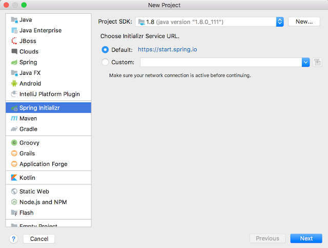
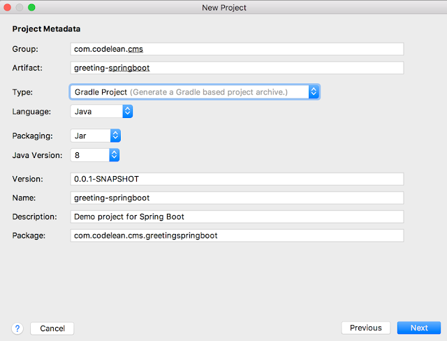
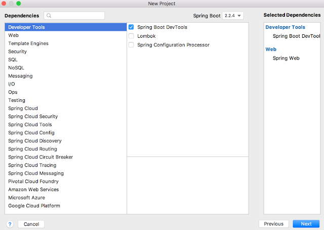
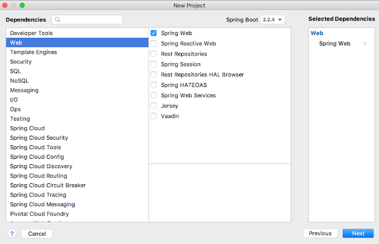
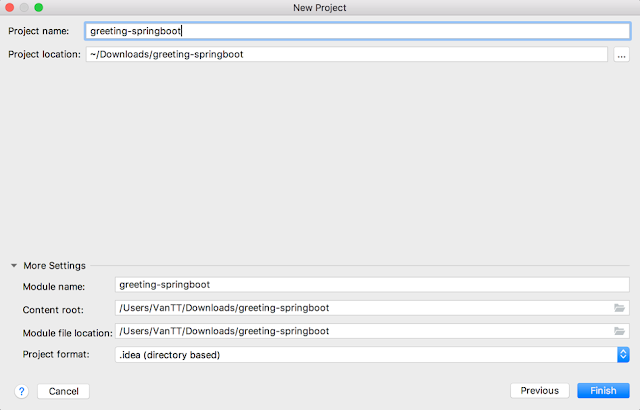
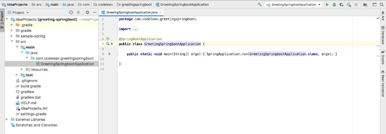
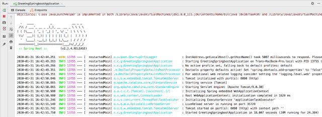

## Tạo ứng dụng Spring Boot sử dụng IntellJ Idea

Trong phần này hướng dẫn tạo ứng dụng Spring Boot sử dụng IntelliJ Idea

Bước 1:Mở IntelliJ Idea

Bước 2:Chọn next

Bước 3:Chọn next

Bước 4:Chọn Web=>Spring Web=>Chọn next

Bước 5:Chọn Finish

Bước 6:Run Project

