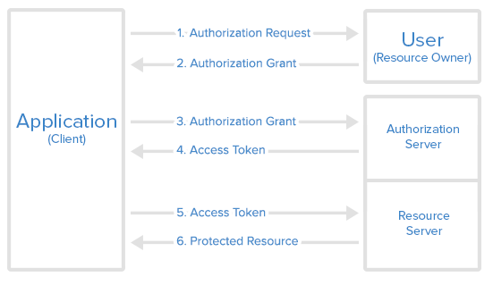

## Giới thiệu về OAuth 2

OAuth 2 là một phương thức ủy quyền để cung cấp quyền truy cập vào các tài nguyên được bảo vệ qua giao thức HTTP. Về cơ bản, oauth2 cho phép ứng dụng của bên thứ ba có quyền truy cập hạn chế vào dịch vụ HTTP

- Thay cho chủ sở hữu tài nguyên bằng cách sắp xếp tương tác phê duyệt giữa chủ sở hữu và dịch vụ HTTP
- Hoặc bằng cách cho phép ứng dụng của bên thứ ba có quyền truy cập thay mặt cho chính ứng dụng đó.

## Vai trò

OAuth xác định bốn vai trò:

- **Chủ sở hữu tài nguyên** - Người sử dụng ứng dụng.
- **Máy khách** - ứng dụng (người dùng đang sử dụng) yêu cầu quyền truy cập vào dữ liệu người dùng trên máy chủ tài nguyên.
- **Máy chủ tài nguyên** - lưu trữ dữ liệu của người dùng và các dịch vụ http có thể trả lại dữ liệu người dùng cho các máy khách đã được xác thực.
- **Máy chủ ủy quyền** - chịu trách nhiệm xác thực danh tính của người dùng và cung cấp mã thông báo ủy quyền. Mã thông báo này được máy chủ tài nguyên chấp nhận và xác thực danh tính của bạn.
  
